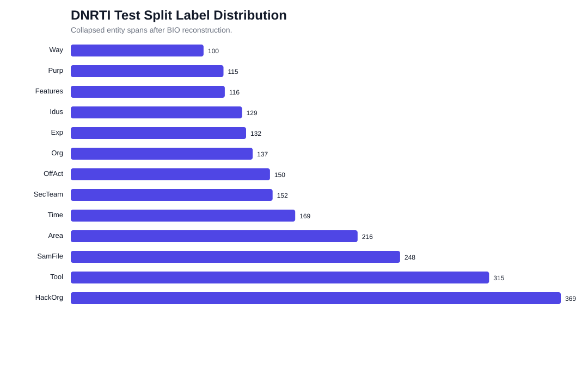
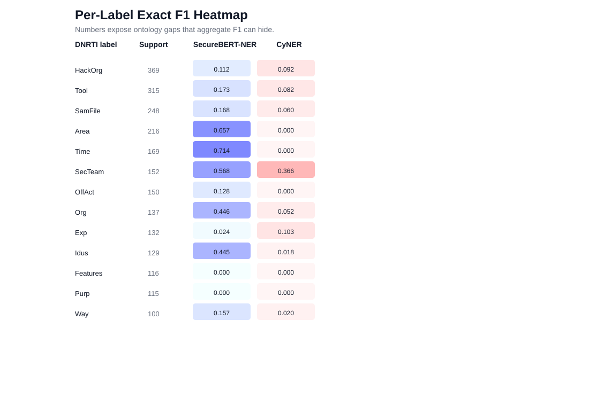

# 01 — Dataset & Label Mapping

This document covers the DNRTI test split we evaluate on and the taxonomy projection that
makes a fair-as-possible comparison between two models with incompatible label sets.

---

## 1. DNRTI dataset audit

The authoritative source is the user-provided DNRTI GitHub repository. The archive contains
`train.txt`, `valid.txt`, and `test.txt` in a CoNLL-like token/tag (BIO) format. The final
claim is computed on the **published `test.txt` split without resampling**.

| Split | Sentences | Tokens | Labeled BIO tokens | Collapsed spans | Malformed lines |
|---|---:|---:|---:|---:|---:|
| test | 664 | 17,716 | 3,606 | 2,348 | 16 |

### Label counts (test split)

| Label | Gold spans | Share |
|---|---:|---:|
| HackOrg | 369 | 15.7% |
| Tool | 315 | 13.4% |
| SamFile | 248 | 10.6% |
| Area | 216 | 9.2% |
| Time | 169 | 7.2% |
| SecTeam | 152 | 6.5% |
| OffAct | 150 | 6.4% |
| Org | 137 | 5.8% |
| Exp | 132 | 5.6% |
| Idus | 129 | 5.5% |
| Features | 116 | 4.9% |
| Purp | 115 | 4.9% |
| Way | 100 | 4.3% |

### Data-quality notes

- The source contains occasional tag-only `O` rows. The parser skips these and counts them as
  malformed source lines rather than treating `O` as a literal token (16 such lines in test).
- Published DNRTI entity totals often count **labeled BIO tokens** (3,606). This report instead
  uses **collapsed spans** (2,348), because strict NER evaluation is span-based, not token-based.
- The split is imbalanced: `HackOrg`, `Tool`, and `SamFile` dominate support, while `Way`,
  `Purp`, and `Features` are low but non-trivial. This is why per-label analysis is necessary.
- Two gold tokens contain embedded zero-width joiners (e.g. `Eset‍`). The loader now strips
  Unicode format characters (category `Cf`) at read time (`data.clean_token`), so these no longer
  shift character offsets or force a guaranteed boundary miss.

### Evaluation implication

A single micro-F1 number hides whether a model is actually useful for the product. For example,
detecting `Time` and `Area` may matter for incident timelines and affected geography even though
they are not the most frequent labels.

---

## 2. Label mapping & taxonomy analysis

The assignment requires comparing models whose taxonomies differ from each other **and** from
DNRTI. The benchmark therefore **projects each model's output labels into DNRTI labels before
scoring**, using the mapping table from the assignment PDF. This projection is the single most
important experimental-design choice in the study — it is not a clerical detail, it changes the
decision.

| CyNER | DNRTI | SecureBERT-NER | Consequence |
|---|---|---|---|
| Organization | HackOrg, SecTeam, Idus, Org | APT, SECTEAM, IDTY | CyNER cannot distinguish actor, security team, identity, and organization. |
| System | OffAct, Way | ACT, OS, TOOL | The broad `System` label creates ambiguity for behavior labels. |
| Vulnerability | Exp | VULID, VULNAME | Both models can target exploit/vulnerability mentions. |
| Malware | Tool | MAL | DNRTI `Tool` is malware/tooling in assignment terms. |
| Indicator | SamFile | FILE | File indicators are comparable. |
| Indicator | *no DNRTI label* | DOM, ENCR, IP, URL, MD5, PROT, EMAIL, SHA1, SHA2 | These SecureBERT IOCs are operationally useful but not credited by DNRTI. |
| *no CyNER label* | Time | TIME | SecureBERT can score timeline entities; CyNER cannot. |
| *no CyNER label* | Area | LOC | SecureBERT can score geography; CyNER cannot. |
| *no CyNER label* | Purp, Features | *no SecureBERT label* | Neither model can directly cover these classes. |

### Discussion

SecureBERT benefits from finer APTNER-style labels for `TIME`, `LOC`, `SECTEAM`, and `IDTY`,
while CyNER's five-label ontology compresses several DNRTI concepts into `Organization` or
`System`. That makes CyNER harder to use when downstream workflows require specific
threat-actor, geography, and identity slots.

The benchmark deliberately **does not credit** SecureBERT's IOC labels (`IP`, `URL`, hashes,
domains, email) unless the PDF maps them to a DNRTI label. Those predictions may be valuable
in production, but counting them as true positives would violate the assignment's evaluation
contract.

> **Fairness consequence (carried into [doc 04](04_leakage_bias_and_intrinsics.md)).** Because
> the mapping is many-to-one for CyNER (e.g. one `Organization` prediction is credited against
> any of four DNRTI org-types) but near one-to-one for SecureBERT, the type half of the task is
> structurally easier for CyNER, while SecureBERT can express more DNRTI labels overall. The
> net structural effect is quantified with an oracle-ceiling analysis rather than assumed.
