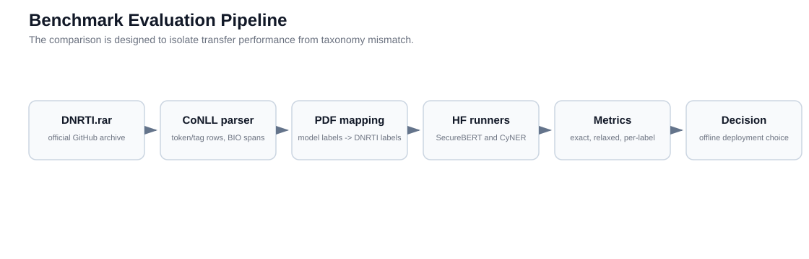
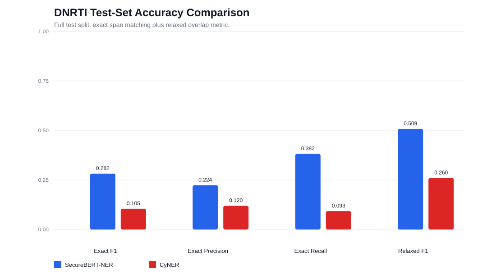

# 02 — Methodology & Results

How the benchmark scores the two models, the headline numbers, per-class behavior, a seqeval
cross-check, and a strict error-bucket analysis.

---

## 1. Evaluation pipeline

Both models are run as **frozen black boxes** from `model_cache/fork1` (no training, no weight
edits), fully offline. For each sentence:

1. **Detokenize** DNRTI tokens into text with character offsets (default: single-space join).
2. **Predict** entity spans with the HF `token-classification` pipeline (`aggregation_strategy="simple"`), which returns character-level start/end offsets and a confidence score.
3. **Project** each predicted model label into DNRTI label(s) via the PDF mapping ([doc 01](01_dataset_and_label_mapping.md)).
4. **Align & score** predicted spans against gold spans.

Default headline protocol: **sentence context, original casing, no normalization, no document
context, strict raw-span scoring.**

### Scoring schemes (SemEval / MUC-style)

The primary metric is **strict entity F1**. Four schemes are reported so the result can be read
under different strictness:

| Scheme | Counts a match when… |
|---|---|
| **strict** | span boundaries match exactly **and** projected type matches |
| **exact** | boundaries match exactly (type ignored) |
| **partial** | spans overlap; exact+type = full credit, overlap-only = half credit |
| **type** | projected type matches on an overlapping span (boundaries relaxed) |

Significance is established with a **paired bootstrap** (10,000 resamples, same sentences for
both models) giving a 95% CI on the F1 gap, plus a **McNemar** test on paired per-entity
correctness. A "flip" means the CI of the gap crosses zero (ranking not significant).

---

## 2. Headline results (full test split)

| Model | Scheme | Precision | Recall | F1 | Gap | 95% CI | Flip? | COR | INC | PAR | MIS | SPU |
|---|---|---:|---:|---:|---:|---|---|---:|---:|---:|---:|---:|
| securebert | strict | 0.2239 | 0.3820 | 0.2823 | 0.1785 | [0.1518, 0.2069] | no | 897 | 894 | 0 | 557 | 2216 |
| cyner | strict | 0.1190 | 0.0920 | 0.1038 | −0.1785 | [−0.2069, −0.1518] | no | 216 | 696 | 0 | 1436 | 903 |
| securebert | exact | 0.2378 | 0.4059 | 0.2999 | 0.1419 | [0.1127, 0.1729] | no | 953 | 838 | 0 | 557 | 2216 |
| cyner | exact | 0.1813 | 0.1401 | 0.1581 | −0.1419 | [−0.1729, −0.1127] | no | 329 | 583 | 0 | 1436 | 903 |
| securebert | partial | 0.3354 | 0.5724 | 0.4230 | 0.1520 | [0.1259, 0.1799] | no | 897 | 0 | 894 | 557 | 2216 |
| cyner | partial | 0.3107 | 0.2402 | 0.2710 | −0.1520 | [−0.1799, −0.1259] | no | 216 | 0 | 696 | 1436 | 903 |
| securebert | type | 0.3976 | 0.6784 | 0.5013 | 0.2530 | [0.2230, 0.2840] | no | 1593 | 198 | 0 | 557 | 2216 |
| cyner | type | 0.2848 | 0.2202 | 0.2484 | −0.2530 | [−0.2840, −0.2230] | no | 517 | 395 | 0 | 1436 | 903 |

**SecureBERT leads under all four schemes**, and no CI crosses zero. The gap is largest on
`type` (+0.2530): even with boundaries relaxed, SecureBERT assigns the right DNRTI class far
more often. CyNER's main failure mode is low recall — it misses 1,436 gold spans (MIS) vs
SecureBERT's 557.

### Cross-experiment decision count

Aggregated across all strict head-to-head configs (methodology + preprocessing + protocol +
subset; see [doc 03](03_robustness_sensitivity_and_subsets.md) and `master_table.jsonl`):

> **SecureBERT wins 90/97 configs, 7 are statistical ties (small subsets), 0 favor CyNER.**

| Direction | Vote | Rationale |
|---|---|---|
| Scoring schemes | SecureBERT | all four SemEval schemes preserve a positive gap |
| Preprocessing | SecureBERT | sweeps did not flip the full-test ranking |
| Subset size | SecureBERT | min-faithful subsets reach stable positive gaps |
| Protocol | SecureBERT | paper-native protocol keeps the positive gap |
| Leakage/bias | SecureBERT *(with caveat)* | oracle + lineage show a structural advantage |
| Operational | SecureBERT | smaller/faster CPU profile at deployment lengths |
| Reliability | SecureBERT *(with caveat)* | robustness holds; raw calibration fails for both |

---

## 3. Per-class strict metrics (FP-counting corrected)

Each prediction now contributes **one** false positive (charged to the first sorted mapped label),
fixing a bug that previously charged one FP per mapped label for one-to-many projections. Recall/TP
still reflect the pre-aggregation-fix predictions and will improve after `make reproduce`; read this
table as *relative class difficulty within each model*.

| Model | Label | Support | TP | FP | FN | Precision | Recall | F1 |
|---|---|---:|---:|---:|---:|---:|---:|---:|
| securebert | Area | 216 | 152 | 95 | 64 | 0.615 | 0.704 | 0.657 |
| securebert | Exp | 132 | 8 | 528 | 124 | 0.015 | 0.061 | 0.024 |
| securebert | Features | 116 | 0 | 0 | 116 | 0.000 | 0.000 | 0.000 |
| securebert | HackOrg | 369 | 51 | 491 | 318 | 0.094 | 0.138 | 0.112 |
| securebert | Idus | 129 | 98 | 102 | 31 | 0.490 | 0.760 | 0.596 |
| securebert | OffAct | 150 | 44 | 400 | 106 | 0.099 | 0.293 | 0.148 |
| securebert | Org | 137 | 100 | 11 | 37 | **0.901** | 0.730 | **0.806** |
| securebert | Purp | 115 | 0 | 0 | 115 | 0.000 | 0.000 | 0.000 |
| securebert | SamFile | 248 | 76 | 581 | 172 | 0.116 | 0.306 | 0.168 |
| securebert | SecTeam | 152 | 105 | 113 | 47 | 0.482 | 0.691 | 0.568 |
| securebert | Time | 169 | 126 | 58 | 43 | 0.685 | 0.746 | 0.714 |
| securebert | Tool | 315 | 87 | 602 | 228 | 0.126 | 0.276 | 0.173 |
| securebert | Way | 100 | 50 | 41 | 50 | **0.549** | 0.500 | **0.524** |
| cyner | Area | 216 | 0 | 0 | 216 | 0.000 | 0.000 | 0.000 |
| cyner | Exp | 132 | 20 | 237 | 112 | 0.078 | 0.152 | 0.103 |
| cyner | Features | 116 | 0 | 0 | 116 | 0.000 | 0.000 | 0.000 |
| cyner | HackOrg | 369 | 31 | 149 | 338 | 0.172 | 0.084 | 0.113 |
| cyner | Idus | 129 | 4 | 1 | 125 | **0.800** | 0.031 | 0.060 |
| cyner | OffAct | 150 | 0 | 197 | 150 | 0.000 | 0.000 | 0.000 |
| cyner | Org | 137 | 12 | 5 | 125 | **0.706** | 0.088 | 0.156 |
| cyner | Purp | 115 | 0 | 0 | 115 | 0.000 | 0.000 | 0.000 |
| cyner | SamFile | 248 | 14 | 207 | 234 | 0.063 | 0.056 | 0.060 |
| cyner | SecTeam | 152 | 86 | 36 | 66 | **0.705** | 0.566 | 0.628 |
| cyner | Time | 169 | 0 | 0 | 169 | 0.000 | 0.000 | 0.000 |
| cyner | Tool | 315 | 46 | 763 | 269 | 0.057 | 0.146 | 0.082 |
| cyner | Way | 100 | 3 | 4 | 97 | **0.429** | 0.030 | 0.056 |

Bolded cells are where the FP fix materially changed precision (the one-to-many label families:
SecureBERT `Org`/`Way` from `IDTY`/`ACT`/`OS`/`TOOL`; CyNER `Idus`/`Org`/`SecTeam`/`Way` from
`Organization`/`System`). Note the org-family FPs are concentrated on the representative label
(`HackOrg` for CyNER), so read the org family together rather than label-by-label there.

**Reading it:** SecureBERT is strong on `Time` (0.71), `Area` (0.66), `Org` (0.81), `Idus`/`SecTeam`
(~0.57–0.60) and `Way` (0.52). CyNER's only competitive recall class is `SecTeam` (0.63); elsewhere
its recall is very low, and it **structurally scores 0 on `Area` and `Time`** (no mapped label) —
both product-critical for incident timelines and geography. Neither model covers `Purp`/`Features`.

### Seqeval cross-check

To confirm the custom scorer, F1 was recomputed with the standard `seqeval` library on the
subset of gold spans whose labels are uniquely expressible by each model. They match exactly:

| Model | Our unique-label F1 | Seqeval F1 | Delta | Unique gold spans |
|---|---:|---:|---:|---:|
| securebert | 0.7300 | 0.7300 | 0.0000 | 1601 |
| cyner | 0.3341 | 0.3341 | 0.0000 | 695 |

---

## 4. Error analysis (strict buckets)

Every prediction/gold pair is bucketed under the headline protocol.

| Model | strict_correct | type_error | boundary_error | strict_drop_fn (missed) | spurious_fp |
|---|---:|---:|---:|---:|---:|
| securebert | 897 | 198 | 696 | 557 | 2216 |
| cyner | 216 | 395 | 301 | 1436 | 903 |

Two very different profiles:

- **SecureBERT** is *high-recall, low-precision*: it finds most entities but over-predicts
  (2,216 spurious FPs, many sub-word fragments) and has many boundary errors.
- **CyNER** is *low-recall*: it simply misses most gold spans (1,436), and when it does fire it
  often assigns the wrong projected type (395 type errors — e.g. tagging threat actors as
  `Malware`/`Tool`).

### Representative examples

| Model | Bucket | Sample | Gold | Predicted | Gold text | Predicted text |
|---|---|---|---|---|---|---|
| securebert | strict_correct | test-00000 | SecTeam | SecTeam | Kaspersky | Kaspersky |
| securebert | strict_correct | test-00000 | HackOrg | HackOrg | Shamoon | Shamoon |
| securebert | boundary_error | test-00000 | HackOrg | HackOrg | StoneDrill | Stone |
| securebert | spurious_fp | test-00000 | SPURIOUS | HackOrg | | groups |
| securebert | strict_drop_fn | test-00002 | Area | O/MISSED | Russian | |
| securebert | type_error | test-00009 | HackOrg | Tool | PUTTER PANDA | PUT |
| securebert | type_error | test-00011 | Tool | OffAct\|Way | RC4 | 4 |
| securebert | type_error | test-00032 | Tool | HackOrg | RTM | RTM |
| cyner | strict_correct | test-00000 | SecTeam | SecTeam | Kaspersky | Kaspersky |
| cyner | type_error | test-00000 | HackOrg | Tool | StoneDrill | StoneDrill |
| cyner | type_error | test-00001 | HackOrg | Tool | BlueNoroff | BlueNoroff |
| cyner | strict_drop_fn | test-00002 | Area | O/MISSED | Russian | |
| cyner | boundary_error | test-00003 | HackOrg | HackOrg | Turla | Tur |
| cyner | spurious_fp | test-00003 | SPURIOUS | HackOrg\|Idus\|Org\|SecTeam | | la |
| cyner | strict_drop_fn | test-00006 | Area | O/MISSED | China | |

The full row-level record (every bucketed entity) is in `methodology_error_analysis.jsonl`;
the entity confusion matrix is in `methodology_confusion_matrix.jsonl`.

---

## 5. Seen vs unseen entity surfaces

Entity surfaces are case-folded and whitespace-normalized, then test entities are split by
whether the same surface string appeared in train. This separates memorization from
generalization.

| Model | Surface status | Support | TP | FP | FN | Precision | Recall | F1 |
|---|---|---:|---:|---:|---:|---:|---:|---:|
| securebert | seen | 2017 | 835 | 699 | 1182 | 0.5443 | 0.4140 | 0.4703 |
| securebert | unseen | 331 | 62 | 2411 | 269 | 0.0251 | 0.1873 | 0.0442 |
| cyner | seen | 2017 | 176 | 244 | 1841 | 0.4190 | 0.0873 | 0.1444 |
| cyner | unseen | 331 | 40 | 1355 | 291 | 0.0287 | 0.1208 | 0.0463 |

Both models collapse on **unseen** surfaces (F1 ≈ 0.04–0.05), which is expected for
cross-dataset transfer. SecureBERT's advantage is concentrated on **seen** surfaces
(0.47 vs 0.14), consistent with its APTNER lineage overlapping DNRTI's common threat-actor and
tooling vocabulary — reinforcing the bias caveat in [doc 04](04_leakage_bias_and_intrinsics.md).

---

## 6. Threats to validity

- The label projection structurally favors SecureBERT; the bias adjustment in [doc 04](04_leakage_bias_and_intrinsics.md) is a ceiling-based sensitivity check, not proof of independent capability.
- APTNER/DNRTI raw-text overlap could not be quantified offline (`data/aptner/` absent), so leakage risk is *unquantified, not disproven*.
- Raw confidence scores do not yield a usable high-precision operating point for either model (see [doc 05](05_operational_and_calibration.md)).
- Energy is estimated where `powermetrics` is unavailable; full `make reproduce` and MPS parity remain future reruns.

**Bottom line:** SecureBERT-NER is the evidence leader on accuracy across every scheme and
config, with the failure modes (over-prediction, boundary fragments) that are fixable downstream;
CyNER's low recall and type confusion are harder to fix. The product should not present the raw
F1 gap as pure model quality without the bias caveat.
