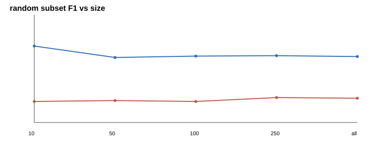
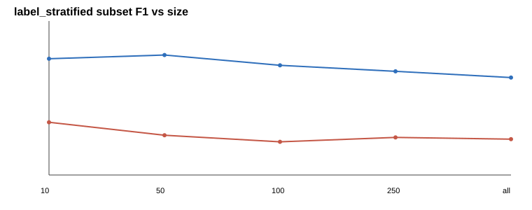
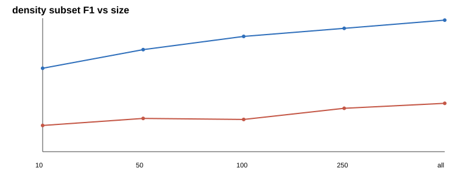
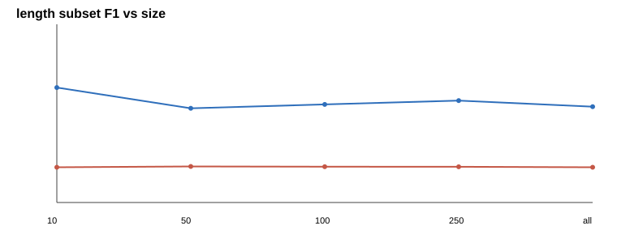
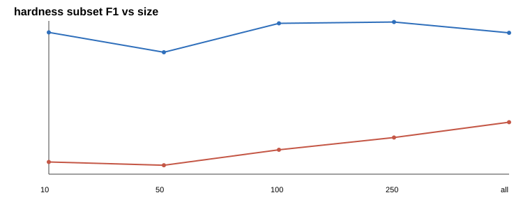

# 03 — Robustness, Sensitivity & Subsets

Does the SecureBERT ranking survive changes to preprocessing, evaluation protocol, input noise,
and dataset size? Short answer: **yes on the full split, every time.** The only sweeps that move
the *absolute* numbers a lot are scorer-leniency knobs (alignment policy) and casing.

---

## 1. Preprocessing sensitivity

Each row varies one preprocessing knob and rescores under strict F1. "Flip?" = does the ranking CI cross zero.

| Config | Model | Strict F1 | Gap | 95% CI | Flip? |
|---|---|---:|---:|---|---|
| detok=single_space | securebert | 0.2823 | 0.1785 | [0.1518, 0.2069] | no |
| detok=single_space | cyner | 0.1038 | −0.1785 | [−0.2069, −0.1518] | no |
| detok=punct_aware | securebert | 0.2767 | 0.1736 | [0.1481, 0.2011] | no |
| detok=punct_aware | cyner | 0.1030 | −0.1736 | [−0.2011, −0.1481] | no |
| context=sentence | securebert | 0.2823 | 0.1785 | [0.1518, 0.2069] | no |
| context=sentence | cyner | 0.1038 | −0.1785 | [−0.2069, −0.1518] | no |
| context=document | securebert | 0.0125 | 0.0074 | [0.0024, 0.0136] | no |
| context=document | cyner | 0.0051 | −0.0074 | [−0.0136, −0.0024] | no |
| context=window | securebert | 0.2116 | 0.1260 | [0.1056, 0.1474] | no |
| context=window | cyner | 0.0856 | −0.1260 | [−0.1474, −0.1056] | no |
| max_length=128 | securebert | 0.2823 | 0.1785 | [0.1518, 0.2069] | no |
| max_length=128 | cyner | 0.1038 | −0.1785 | [−0.2069, −0.1518] | no |
| max_length=256 | securebert | 0.2823 | 0.1785 | [0.1518, 0.2069] | no |
| max_length=256 | cyner | 0.1038 | −0.1785 | [−0.2069, −0.1518] | no |
| max_length=full | securebert | 0.2823 | 0.1785 | [0.1518, 0.2069] | no |
| max_length=full | cyner | 0.1038 | −0.1785 | [−0.2069, −0.1518] | no |
| normalization=none | securebert | 0.2823 | 0.1785 | [0.1518, 0.2069] | no |
| normalization=none | cyner | 0.1038 | −0.1785 | [−0.2069, −0.1518] | no |
| normalization=nfkc | securebert | 0.2823 | 0.1785 | [0.1518, 0.2069] | no |
| normalization=nfkc | cyner | 0.1038 | −0.1785 | [−0.2069, −0.1518] | no |
| normalization=refang | securebert | 0.2823 | 0.1785 | [0.1518, 0.2069] | no |
| normalization=refang | cyner | 0.1038 | −0.1785 | [−0.2069, −0.1518] | no |
| normalization=lower | securebert | 0.1570 | 0.0894 | [0.0666, 0.1130] | no |
| normalization=lower | cyner | 0.0676 | −0.0894 | [−0.1130, −0.0666] | no |
| alignment=overlap | securebert | 0.2823 | 0.1785 | [0.1518, 0.2069] | no |
| alignment=overlap | cyner | 0.1038 | −0.1785 | [−0.2069, −0.1518] | no |
| alignment=majority | securebert | 0.5266 | 0.3051 | [0.2717, 0.3382] | no |
| alignment=majority | cyner | 0.2216 | −0.3051 | [−0.3382, −0.2717] | no |
| alignment=contained | securebert | 0.4617 | 0.3169 | [0.2838, 0.3509] | no |
| alignment=contained | cyner | 0.1448 | −0.3169 | [−0.3509, −0.2838] | no |

**Takeaways.** (1) `context=document` collapses both models — long concatenated input is
truncated, so sentence/window context is the correct setting. (2) `normalization=lower` halves
both scores: **casing carries real signal** for cyber entities. (3) `alignment=majority/contained`
raise absolute F1 by being more lenient about sub-word boundary fragments, but **never flip the
ranking**. No knob reverses the decision.

---

## 2. Protocol comparison

`pdf_mapping` is the assignment's mapping; `paper_native` uses the models' own taxonomies with
punct-aware detok at max_length=128.

| Protocol | Model | Strict F1 | Gap | 95% CI | Flip? |
|---|---|---:|---:|---|---|
| pdf_mapping | securebert | 0.2823 | 0.1785 | [0.1518, 0.2069] | no |
| pdf_mapping | cyner | 0.1038 | −0.1785 | [−0.2069, −0.1518] | no |
| paper_native | securebert | 0.2767 | 0.1736 | [0.1481, 0.2011] | no |
| paper_native | cyner | 0.1030 | −0.1736 | [−0.2011, −0.1481] | no |

SecureBERT's gap moves only −0.0049 from PDF-mapping to paper-native. The seqeval cross-check
holds under both protocols (deltas of 0.0000). Unique-label coverage explains part of the gap:
SecureBERT can uniquely express **68.2%** of gold spans vs CyNER's **29.6%** — CyNER's coarse
ontology leaves many DNRTI labels non-uniquely addressable (`Area`, `HackOrg`, `SecTeam`,
`Time`, etc.).

---

## 3. Input perturbation robustness

Clean vs perturbed strict F1 (paired CIs). "Flip?" tracks whether the ranking changes.

| Perturbation | Model | Clean F1 | Noisy F1 | Δ F1 | Δ 95% CI | Gap vs other | Flip? |
|---|---|---:|---:|---:|---|---:|---|
| defang | securebert | 0.2823 | 0.2839 | +0.0016 | [−0.0015, 0.0049] | 0.1941 | no |
| defang | cyner | 0.1038 | 0.0898 | −0.0139 | [−0.0202, −0.0081] | −0.1941 | no |
| refang | securebert | 0.2823 | 0.2823 | 0.0000 | [0.0000, 0.0000] | 0.1785 | no |
| refang | cyner | 0.1038 | 0.1038 | 0.0000 | [0.0000, 0.0000] | −0.1785 | no |
| random_case | securebert | 0.2823 | 0.0296 | −0.2527 | [−0.2766, −0.2300] | 0.0238 | no |
| random_case | cyner | 0.1038 | 0.0058 | −0.0980 | [−0.1130, −0.0836] | −0.0238 | no |
| keyboard_typo | securebert | 0.2823 | 0.2177 | −0.0645 | [−0.0765, −0.0535] | 0.1152 | no |
| keyboard_typo | cyner | 0.1038 | 0.1025 | −0.0012 | [−0.0097, 0.0070] | −0.1152 | no |

SecureBERT keeps a positive gap under every perturbation. **Random casing is catastrophic for
both** (SecureBERT −0.25), confirming the casing-signal finding above — production text should be
case-normalized/monitored upstream. `defang`/`refang` are near-neutral.

> Follow-up: rerun this sweep end-to-end after the perturbation-RNG fix (see README).

---

## 4. Dataset-size scaling

Both models see the **same** deterministic paired subsets.

| Model | Subset | Samples | Exact F1 | Exact P | Exact R | Relaxed F1 |
|---|---|---:|---:|---:|---:|---:|
| CyNER | 10 | 10 | 0.0303 | 0.0286 | 0.0323 | 0.2424 |
| CyNER | 100 | 100 | 0.1180 | 0.1324 | 0.1065 | 0.2721 |
| CyNER | all | 664 | 0.1047 | 0.1201 | 0.0928 | 0.2604 |
| SecureBERT-NER | 10 | 10 | 0.1782 | 0.1286 | 0.2903 | 0.3960 |
| SecureBERT-NER | 100 | 100 | 0.2423 | 0.1855 | 0.3491 | 0.4887 |
| SecureBERT-NER | all | 664 | 0.2823 | 0.2239 | 0.3820 | 0.5086 |

The 10-sentence point is a smoke test (only ~31 gold spans, high variance). By 100 sentences the
ranking is stable, and the full split keeps a large margin under both exact and relaxed scoring —
so the gap reflects semantic recognition, not boundary calibration.

---

## 5. Subset study (five strategies × sizes × seeds)

The **min-faithful subset** is the smallest size at which the full-split winner wins with a 95%
CI excluding 0 for all three seeds.

| Strategy | Min-faithful subset |
|---|---|
| random | 50 |
| label_stratified | 50 |
| density | 50 |
| length | 50 |
| hardness | 10 |

> **Methodology fix.** The `hardness` strategy was previously deterministic (it took a fixed
> top-k), so its three "seeds" produced identical subsets and exactly zero variance. It now samples
> among *equally-hard* samples at the cutoff boundary, keeping the subset hard-biased while making
> the seed meaningful. The `hardness` rows below predate this fix (variance 0) and refresh on the
> next `make reproduce`; the other strategies are unaffected.

### F1 variance by cell (3 seeds each)

| Strategy | Size | Model | Mean F1 | Variance | Min F1 | Max F1 |
|---|---|---|---:|---:|---:|---:|
| random | 10 | cyner | 0.0899 | 0.000386 | 0.0678 | 0.1053 |
| random | 10 | securebert | 0.3274 | 0.013517 | 0.2564 | 0.4615 |
| random | 50 | cyner | 0.0941 | 0.000318 | 0.0738 | 0.1074 |
| random | 50 | securebert | 0.2784 | 0.001594 | 0.2428 | 0.3216 |
| random | 100 | cyner | 0.0899 | 0.000174 | 0.0751 | 0.1004 |
| random | 100 | securebert | 0.2843 | 0.001218 | 0.2451 | 0.3118 |
| random | 250 | cyner | 0.1067 | 0.000011 | 0.1031 | 0.1096 |
| random | 250 | securebert | 0.2862 | 0.000286 | 0.2754 | 0.3057 |
| label_stratified | 10 | cyner | 0.1527 | 0.000645 | 0.1351 | 0.1818 |
| label_stratified | 10 | securebert | 0.3370 | 0.008966 | 0.2810 | 0.4463 |
| label_stratified | 50 | cyner | 0.1151 | 0.000008 | 0.1121 | 0.1176 |
| label_stratified | 50 | securebert | 0.3477 | 0.003378 | 0.2828 | 0.3949 |
| label_stratified | 100 | cyner | 0.0962 | 0.000260 | 0.0832 | 0.1142 |
| label_stratified | 100 | securebert | 0.3178 | 0.000191 | 0.3023 | 0.3289 |
| label_stratified | 250 | cyner | 0.1089 | 0.000140 | 0.0978 | 0.1214 |
| label_stratified | 250 | securebert | 0.3005 | 0.000065 | 0.2937 | 0.3094 |
| density | 10 | cyner | 0.0562 | 0.001508 | 0.0227 | 0.0988 |
| density | 10 | securebert | 0.1791 | 0.007968 | 0.1000 | 0.2759 |
| density | 50 | cyner | 0.0714 | 0.000205 | 0.0594 | 0.0872 |
| density | 50 | securebert | 0.2190 | 0.000989 | 0.1933 | 0.2541 |
| density | 100 | cyner | 0.0692 | 0.000348 | 0.0547 | 0.0902 |
| density | 100 | securebert | 0.2473 | 0.001033 | 0.2129 | 0.2765 |
| density | 250 | cyner | 0.0931 | 0.000213 | 0.0828 | 0.1098 |
| density | 250 | securebert | 0.2647 | 0.000361 | 0.2514 | 0.2864 |
| length | 10 | cyner | 0.1037 | 0.004121 | 0.0357 | 0.1633 |
| length | 10 | securebert | 0.3386 | 0.026471 | 0.2254 | 0.5250 |
| length | 50 | cyner | 0.1062 | 0.002175 | 0.0673 | 0.1579 |
| length | 50 | securebert | 0.2776 | 0.004626 | 0.2371 | 0.3562 |
| length | 100 | cyner | 0.1055 | 0.000691 | 0.0864 | 0.1355 |
| length | 100 | securebert | 0.2891 | 0.000793 | 0.2673 | 0.3209 |
| length | 250 | cyner | 0.1052 | 0.000008 | 0.1023 | 0.1081 |
| length | 250 | securebert | 0.3001 | 0.000000 | 0.2998 | 0.3005 |
| hardness | 10 | cyner | 0.0244 | 0.000000 | 0.0244 | 0.0244 |
| hardness | 10 | securebert | 0.2830 | 0.000000 | 0.2830 | 0.2830 |
| hardness | 50 | cyner | 0.0178 | 0.000000 | 0.0178 | 0.0178 |
| hardness | 50 | securebert | 0.2434 | 0.000000 | 0.2434 | 0.2434 |
| hardness | 100 | cyner | 0.0487 | 0.000000 | 0.0483 | 0.0492 |
| hardness | 100 | securebert | 0.3012 | 0.000001 | 0.3000 | 0.3020 |
| hardness | 250 | cyner | 0.0732 | 0.000000 | 0.0730 | 0.0734 |
| hardness | 250 | securebert | 0.3039 | 0.000004 | 0.3024 | 0.3060 |

At `size=all` every cell converges to the full-split values (SecureBERT 0.2823 / CyNER 0.1038,
variance 0). The only ties (CI crosses 0) occur at **size=10**, e.g. random seeds 1–2,
label_stratified seeds 1 & 3, density seed 1, length seed 3 — small samples are simply
underpowered. The complete per-seed decision table (with every CI) is in `subset_study.jsonl`.

### Per-strategy curves

**Conclusion:** small subsets (≤10) are not decision-grade, but from 50 sentences onward every
sampling strategy reproduces the SecureBERT win with a significant CI.
