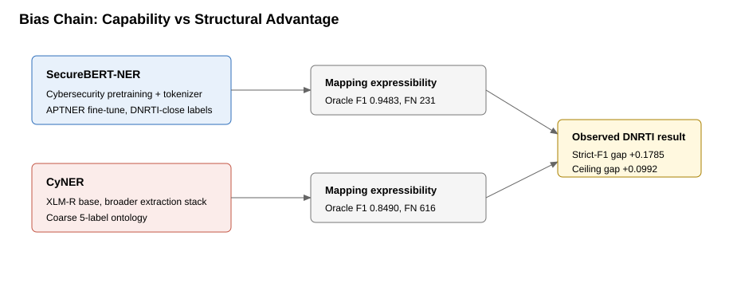

# 04 — Leakage, Bias & Intrinsics

The raw F1 gap is real, but **how much of it is recognition skill vs. structural advantage?**
This document reviews training lineage, leakage risk, and the label-projection handicap, then
quantifies a conservative bias-adjusted residual.

---

## 1. Literature review & leakage

**Research questions:** (1) Were the assigned checkpoints trained on DNRTI? (2) Do related
corpora create leakage/overlap risk? (3) How should that change interpretation?

### Findings

- **`CyberPeace-Institute/SecureBERT-NER`** is documented as SecureBERT fine-tuned on **APTNER**,
  not DNRTI. The base SecureBERT was pretrained on broad cybersecurity text, so raw public-report
  overlap remains possible, but no supervised DNRTI exposure was found.
- **`AI4Sec/cyner-xlm-roberta-base`** exposes CyNER's five-label taxonomy (`System`,
  `Organization`, `Vulnerability`, `Malware`, `Indicator`). Public CyNER descriptions point to a
  separate Android-malware CTI corpus, not DNRTI.
- **CyberNER** is *not* a valid drop-in replacement model for this benchmark: it harmonizes DNRTI
  together with CyNER, APTNER, and Attacker, so it is contaminated by construction unless DNRTI is
  explicitly held out.

### Leakage risk

| Artifact | DNRTI supervised exposure | Risk | Interpretation |
|---|---|---|---|
| SecureBERT-NER | None found | Medium | APTNER domain transfer; possible raw-report overlap. |
| CyNER HF checkpoint | None found | Medium | Separate CTI corpus; broad taxonomy hurts direct DNRTI comparability. |
| CyberNER-derived models | Yes, by construction | High | Contaminated unless DNRTI is held out. |

The correct framing of this study is **cross-dataset transfer under a forced taxonomy
projection** — which is exactly the deployment setting: the chosen model must work on
threat-intel text it was not fine-tuned for. It should **not** be read as an in-domain
supervised DNRTI leaderboard.

---

## 2. Bias audit (lineage + projection handicap)

| Model | Public lineage | Bias implication |
|---|---|---|
| SecureBERT-NER | SecureBERT fine-tuned on APTNER; cyber-domain pretraining. | Cyber-domain pretraining + APTNER fine-tuning + a DNRTI-adjacent ontology all structurally favor it. |
| CyNER | XLM-R token classifier; broader cyber-NER library with a coarser event ontology. | The DNRTI projection compresses several labels into each CyNER label, leaving a lower ceiling. |

### APTNER / DNRTI overlap

`data/aptner/` is **not present** in this offline workspace, so 8-gram and sentence-hash overlap
could not be computed. Overlap risk is therefore **unquantified, not disproven**.

### Mapping handicap — oracle ceiling

The "oracle" gives each model perfect detection but only for DNRTI labels it can express, isolating
the ceiling imposed by the taxonomy projection alone.

| Model | Oracle precision | Oracle recall | Oracle F1 | Expressible labels |
|---|---:|---:|---:|---|
| SecureBERT | 1.0000 | 0.9016 | 0.9483 | Area, Exp, HackOrg, Idus, OffAct, Org, SamFile, SecTeam, Time, Tool, Way |
| CyNER | 1.0000 | 0.7376 | 0.8490 | Exp, HackOrg, Idus, OffAct, Org, SamFile, SecTeam, Tool, Way |

CyNER cannot express `Area` or `Time` at all under the mapping — a built-in recall ceiling.

### Capability vs. bias decomposition

| Quantity | Value | As % of raw gap |
|---|---:|---:|
| Raw PDF-mapping strict-F1 gap | 0.1785 | 100% |
| Oracle ceiling gap (taxonomy only) | 0.0992 | 55.6% |
| **Bias-adjusted residual gap** | **0.0793** | 44.4% |

**Interpretation.** Roughly **half** of the raw gap is attributable to the taxonomy projection
ceiling; the remaining **+0.0793 residual stays positive**, so SecureBERT is still the better
*mapped-DNRTI* choice even after a conservative handicap. This is a sensitivity ceiling, **not a
causal decomposition** — the product should not present the full raw gap as pure recognition
quality.

---

## 3. Intrinsic metrics

Model-only properties (no gold labels), useful for explaining the behavior above.

| Model | Entity fertility | Probe fertility | Probe 1-token coverage | Parameters | Cache MB |
|---|---:|---:|---:|---:|---:|
| securebert | 1.5058 | 2.5714 | 0.4286 | 124,085,800 | 950.1 |
| cyner | 1.9395 | 3.4286 | 0.0000 | 277,461,515 | 1072.0 |

*Fertility* = average sub-word pieces per word (lower is better-matched to the domain). On the
cyber probe set (`ransomware`, `C2`, `powershell`, `T1059.001`, `CVE-2021-44228`, `mimikatz`,
`hxxp`), SecureBERT keeps **42.9%** of probes as single tokens; CyNER's XLM-R tokenizer keeps
**0%** and shatters them into 3.4 pieces on average. A domain-matched tokenizer is part of why
SecureBERT both recognizes more and runs faster.

### Oracle upper bound (recap)

| Model | Oracle precision | Oracle recall | Oracle F1 |
|---|---:|---:|---:|
| securebert | 1.0000 | 0.9016 | 0.9483 |
| cyner | 1.0000 | 0.7376 | 0.8490 |

---

## Sources

- SecureBERT-NER: <https://huggingface.co/CyberPeace-Institute/SecureBERT-NER>
- SecureBERT paper: <https://arxiv.org/abs/2204.02685>
- CyNER paper: <https://arxiv.org/abs/2204.05754>
- CyNER checkpoint: <https://huggingface.co/AI4Sec/cyner-xlm-roberta-base>
- DNRTI dataset: <https://github.com/SCreaMxp/DNRTI-A-Large-scale-Dataset-for-Named-Entity-Recognition-in-Threat-Intelligence>
- CyberNER paper: <https://arxiv.org/abs/2510.26499>
