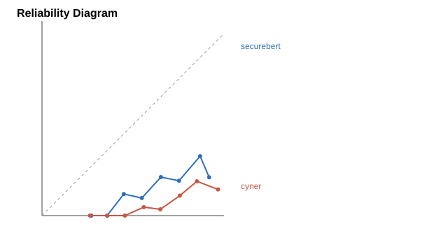

# Calibration

| Model | ECE | Entity predictions | Recommended threshold | Precision | Recall |
|---|---:|---:|---:|---:|---:|
| securebert | 0.6520 | 4007 | unreachable |  |  |
| cyner | 0.7044 | 1815 | unreachable |  |  |

## Threshold Sweep

| Model | Threshold | Predictions | Precision | Recall |
|---|---:|---:|---:|---:|
| securebert | 0.00 | 4007 | 0.2239 | 0.3820 |
| securebert | 0.05 | 4007 | 0.2239 | 0.3820 |
| securebert | 0.10 | 4007 | 0.2239 | 0.3820 |
| securebert | 0.15 | 4007 | 0.2239 | 0.3820 |
| securebert | 0.20 | 4007 | 0.2239 | 0.3820 |
| securebert | 0.25 | 4006 | 0.2239 | 0.3820 |
| securebert | 0.30 | 4002 | 0.2241 | 0.3820 |
| securebert | 0.35 | 3996 | 0.2245 | 0.3820 |
| securebert | 0.40 | 3988 | 0.2249 | 0.3820 |
| securebert | 0.45 | 3948 | 0.2264 | 0.3807 |
| securebert | 0.50 | 3912 | 0.2270 | 0.3782 |
| securebert | 0.55 | 3871 | 0.2284 | 0.3765 |
| securebert | 0.60 | 3829 | 0.2298 | 0.3748 |
| securebert | 0.65 | 3774 | 0.2297 | 0.3693 |
| securebert | 0.70 | 3706 | 0.2304 | 0.3637 |
| securebert | 0.75 | 3630 | 0.2314 | 0.3578 |
| securebert | 0.80 | 3544 | 0.2322 | 0.3505 |
| securebert | 0.85 | 3387 | 0.2273 | 0.3279 |
| securebert | 0.90 | 2873 | 0.2102 | 0.2572 |
| securebert | 0.95 | 0 | 0.0000 | 0.0000 |
| securebert | 0.99 | 0 | 0.0000 | 0.0000 |
| cyner | 0.00 | 1815 | 0.1201 | 0.0928 |
| cyner | 0.05 | 1815 | 0.1201 | 0.0928 |
| cyner | 0.10 | 1815 | 0.1201 | 0.0928 |
| cyner | 0.15 | 1815 | 0.1201 | 0.0928 |
| cyner | 0.20 | 1815 | 0.1201 | 0.0928 |
| cyner | 0.25 | 1814 | 0.1202 | 0.0928 |
| cyner | 0.30 | 1810 | 0.1204 | 0.0928 |
| cyner | 0.35 | 1795 | 0.1214 | 0.0928 |
| cyner | 0.40 | 1764 | 0.1236 | 0.0928 |
| cyner | 0.45 | 1735 | 0.1256 | 0.0928 |
| cyner | 0.50 | 1692 | 0.1288 | 0.0928 |
| cyner | 0.55 | 1630 | 0.1325 | 0.0920 |
| cyner | 0.60 | 1541 | 0.1369 | 0.0899 |
| cyner | 0.65 | 1473 | 0.1412 | 0.0886 |
| cyner | 0.70 | 1397 | 0.1475 | 0.0877 |
| cyner | 0.75 | 1297 | 0.1557 | 0.0860 |
| cyner | 0.80 | 1160 | 0.1552 | 0.0767 |
| cyner | 0.85 | 1022 | 0.1536 | 0.0669 |
| cyner | 0.90 | 868 | 0.1440 | 0.0532 |
| cyner | 0.95 | 644 | 0.1460 | 0.0400 |
| cyner | 0.99 | 276 | 0.0870 | 0.0102 |
