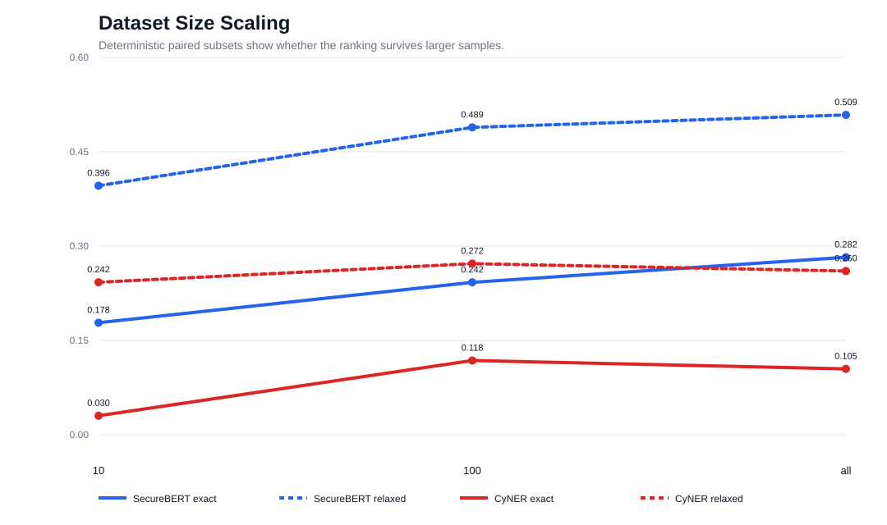

# Dataset Size Scaling Effects

## Motivation

Small NER subsets can produce unstable rankings because a few long reports or
entity-rich sentences dominate the denominator. The benchmark therefore uses
deterministic paired subsets: both models see the same 10-sentence subset,
the same 100-sentence subset, and the full DNRTI test split.

| Model | Subset | Samples | Exact F1 | Exact P | Exact R | Relaxed F1 |
|---|---|---:|---:|---:|---:|---:|
| CyNER | 10 | 10 | 0.0303 | 0.0286 | 0.0323 | 0.2424 |
| CyNER | 100 | 100 | 0.1180 | 0.1324 | 0.1065 | 0.2721 |
| CyNER | all | 664 | 0.1047 | 0.1201 | 0.0928 | 0.2604 |
| SecureBERT-NER | 10 | 10 | 0.1782 | 0.1286 | 0.2903 | 0.3960 |
| SecureBERT-NER | 100 | 100 | 0.2423 | 0.1855 | 0.3491 | 0.4887 |
| SecureBERT-NER | all | 664 | 0.2823 | 0.2239 | 0.3820 | 0.5086 |

## Discussion

The 10-sentence point is a smoke test, not a decision basis. It already
suggests SecureBERT is stronger, but variance is high because only 31 gold
spans are present. At 100 samples the ranking stabilizes, and on the full
664-sentence test split SecureBERT maintains a large margin under both
strict and relaxed scoring.

The same ranking under exact and relaxed matching is important. If relaxed
F1 reversed the decision, the benchmark would be diagnosing boundary
calibration rather than semantic recognition. It does not: SecureBERT is
better even after giving both models partial-boundary credit.
