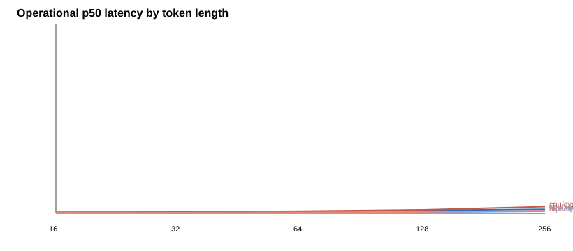
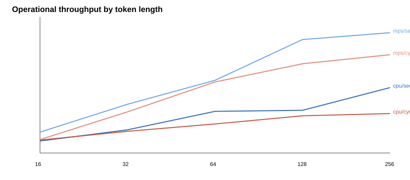

# Operational Envelope

CPU is deployment-relevant because the offline Docker image ships CPU-only torch; MPS is the local-dev ceiling.

| Device | Model | Tokens | Batch | p50 ms | p95 ms | p99 ms | sent/s | tok/s | RSS MB | Load s | Energy J | Energy source | Cache MB |
|---|---|---:|---:|---:|---:|---:|---:|---:|---:|---:|---:|---|---:|
| cpu | securebert | 16 | 1 | 25.64 | 25.64 | 25.64 | 38.99 | 623.91 | 291.0 | 0.11 | 0.64 | estimated | 950.1 |
| cpu | securebert | 16 | 8 | 46.96 | 46.96 | 46.96 | 170.35 | 2725.58 | 291.0 | 0.11 | 1.17 | estimated | 950.1 |
| cpu | securebert | 16 | 32 | 209.04 | 209.04 | 209.04 | 153.08 | 2449.35 | 291.0 | 0.11 | 5.23 | estimated | 950.1 |
| cpu | securebert | 32 | 1 | 26.54 | 26.54 | 26.54 | 37.67 | 1205.55 | 291.0 | 0.11 | 0.66 | estimated | 950.1 |
| cpu | securebert | 32 | 8 | 105.27 | 105.27 | 105.27 | 75.99 | 2431.78 | 291.0 | 0.11 | 2.63 | estimated | 950.1 |
| cpu | securebert | 32 | 32 | 421.97 | 421.97 | 421.97 | 75.83 | 2426.69 | 291.0 | 0.11 | 10.55 | estimated | 950.1 |
| cpu | securebert | 64 | 1 | 29.55 | 29.55 | 29.55 | 33.85 | 2166.16 | 291.0 | 0.11 | 0.74 | estimated | 950.1 |
| cpu | securebert | 64 | 8 | 150.17 | 150.17 | 150.17 | 53.27 | 3409.50 | 291.0 | 0.11 | 3.75 | estimated | 950.1 |
| cpu | securebert | 64 | 32 | 669.57 | 669.57 | 669.57 | 47.79 | 3058.69 | 291.0 | 0.11 | 16.74 | estimated | 950.1 |
| cpu | securebert | 128 | 1 | 57.63 | 57.63 | 57.63 | 17.35 | 2221.06 | 291.0 | 0.11 | 1.44 | estimated | 950.1 |
| cpu | securebert | 128 | 8 | 324.57 | 324.57 | 324.57 | 24.65 | 3154.91 | 291.0 | 0.11 | 8.11 | estimated | 950.1 |
| cpu | securebert | 128 | 32 | 1116.43 | 1116.43 | 1116.43 | 28.66 | 3669.75 | 291.0 | 0.11 | 27.91 | estimated | 950.1 |
| cpu | securebert | 256 | 1 | 75.24 | 75.24 | 75.24 | 13.29 | 3402.47 | 291.0 | 0.11 | 1.88 | estimated | 950.1 |
| cpu | securebert | 256 | 8 | 613.53 | 613.53 | 613.53 | 13.04 | 3338.04 | 291.0 | 0.11 | 15.34 | estimated | 950.1 |
| cpu | securebert | 256 | 32 | 2514.06 | 2514.06 | 2514.06 | 12.73 | 3258.47 | 291.0 | 0.11 | 62.85 | estimated | 950.1 |
| cpu | cyner | 16 | 1 | 23.73 | 23.73 | 23.73 | 42.14 | 674.29 | 780.7 | 0.42 | 0.59 | estimated | 1072.0 |
| cpu | cyner | 16 | 8 | 67.96 | 67.96 | 67.96 | 117.72 | 1883.48 | 780.7 | 0.42 | 1.70 | estimated | 1072.0 |
| cpu | cyner | 16 | 32 | 246.30 | 246.30 | 246.30 | 129.92 | 2078.77 | 780.7 | 0.42 | 6.16 | estimated | 1072.0 |
| cpu | cyner | 32 | 1 | 28.33 | 28.33 | 28.33 | 35.30 | 1129.51 | 780.7 | 0.42 | 0.71 | estimated | 1072.0 |
| cpu | cyner | 32 | 8 | 122.41 | 122.41 | 122.41 | 65.35 | 2091.26 | 780.7 | 0.42 | 3.06 | estimated | 1072.0 |
| cpu | cyner | 32 | 32 | 549.25 | 549.25 | 549.25 | 58.26 | 1864.34 | 780.7 | 0.42 | 13.73 | estimated | 1072.0 |
| cpu | cyner | 64 | 1 | 42.39 | 42.39 | 42.39 | 23.59 | 1509.92 | 780.7 | 0.42 | 1.06 | estimated | 1072.0 |
| cpu | cyner | 64 | 8 | 197.99 | 197.99 | 197.99 | 40.41 | 2586.01 | 780.7 | 0.42 | 4.95 | estimated | 1072.0 |
| cpu | cyner | 64 | 32 | 791.80 | 791.80 | 791.80 | 40.41 | 2586.52 | 780.7 | 0.42 | 19.79 | estimated | 1072.0 |
| cpu | cyner | 128 | 1 | 66.12 | 66.12 | 66.12 | 15.12 | 1935.76 | 780.7 | 0.42 | 1.65 | estimated | 1072.0 |
| cpu | cyner | 128 | 8 | 430.16 | 430.16 | 430.16 | 18.60 | 2380.52 | 780.7 | 0.42 | 10.75 | estimated | 1072.0 |
| cpu | cyner | 128 | 32 | 1523.66 | 1523.66 | 1523.66 | 21.00 | 2688.92 | 780.7 | 0.42 | 38.09 | estimated | 1072.0 |
| cpu | cyner | 256 | 1 | 124.69 | 124.69 | 124.69 | 8.02 | 2053.16 | 780.7 | 0.42 | 3.12 | estimated | 1072.0 |
| cpu | cyner | 256 | 8 | 806.69 | 806.69 | 806.69 | 9.92 | 2538.77 | 780.7 | 0.42 | 20.17 | estimated | 1072.0 |
| cpu | cyner | 256 | 32 | 3581.32 | 3581.32 | 3581.32 | 8.94 | 2287.42 | 780.7 | 0.42 | 89.53 | estimated | 1072.0 |
| mps | securebert | 16 | 1 | 14.73 | 14.73 | 14.73 | 67.91 | 1086.51 | 301.1 | 0.74 | 0.37 | estimated | 950.1 |
| mps | securebert | 16 | 8 | 25.83 | 25.83 | 25.83 | 309.78 | 4956.43 | 301.1 | 0.74 | 0.65 | estimated | 950.1 |
| mps | securebert | 16 | 32 | 106.71 | 106.71 | 106.71 | 299.88 | 4798.06 | 301.1 | 0.74 | 2.67 | estimated | 950.1 |
| mps | securebert | 32 | 1 | 12.62 | 12.62 | 12.62 | 79.22 | 2535.08 | 301.1 | 0.74 | 0.32 | estimated | 950.1 |
| mps | securebert | 32 | 8 | 43.78 | 43.78 | 43.78 | 182.72 | 5847.16 | 301.1 | 0.74 | 1.09 | estimated | 950.1 |
| mps | securebert | 32 | 32 | 260.13 | 260.13 | 260.13 | 123.02 | 3936.50 | 301.1 | 0.74 | 6.50 | estimated | 950.1 |
| mps | securebert | 64 | 1 | 16.93 | 16.93 | 16.93 | 59.07 | 3780.63 | 301.1 | 0.74 | 0.42 | estimated | 950.1 |
| mps | securebert | 64 | 8 | 72.37 | 72.37 | 72.37 | 110.54 | 7074.35 | 301.1 | 0.74 | 1.81 | estimated | 950.1 |
| mps | securebert | 64 | 32 | 318.50 | 318.50 | 318.50 | 100.47 | 6430.05 | 301.1 | 0.74 | 7.96 | estimated | 950.1 |
| mps | securebert | 128 | 1 | 21.69 | 21.69 | 21.69 | 46.11 | 5902.39 | 301.1 | 0.74 | 0.54 | estimated | 950.1 |
| mps | securebert | 128 | 8 | 166.27 | 166.27 | 166.27 | 48.11 | 6158.54 | 301.1 | 0.74 | 4.16 | estimated | 950.1 |
| mps | securebert | 128 | 32 | 659.17 | 659.17 | 659.17 | 48.55 | 6215.42 | 301.1 | 0.74 | 16.48 | estimated | 950.1 |
| mps | securebert | 256 | 1 | 40.91 | 40.91 | 40.91 | 24.44 | 6257.24 | 301.1 | 0.74 | 1.02 | estimated | 950.1 |
| mps | securebert | 256 | 8 | 298.51 | 298.51 | 298.51 | 26.80 | 6860.79 | 301.1 | 0.74 | 7.46 | estimated | 950.1 |
| mps | securebert | 256 | 32 | 1349.00 | 1349.00 | 1349.00 | 23.72 | 6072.64 | 301.1 | 0.74 | 33.73 | estimated | 950.1 |
| mps | cyner | 16 | 1 | 22.83 | 22.83 | 22.83 | 43.80 | 700.87 | 407.9 | 1.62 | 0.57 | estimated | 1072.0 |
| mps | cyner | 16 | 8 | 43.57 | 43.57 | 43.57 | 183.62 | 2937.91 | 407.9 | 1.62 | 1.09 | estimated | 1072.0 |
| mps | cyner | 16 | 32 | 116.15 | 116.15 | 116.15 | 275.51 | 4408.20 | 407.9 | 1.62 | 2.90 | estimated | 1072.0 |
| mps | cyner | 32 | 1 | 14.95 | 14.95 | 14.95 | 66.90 | 2140.87 | 407.9 | 1.62 | 0.37 | estimated | 1072.0 |
| mps | cyner | 32 | 8 | 61.36 | 61.36 | 61.36 | 130.37 | 4171.97 | 407.9 | 1.62 | 1.53 | estimated | 1072.0 |
| mps | cyner | 32 | 32 | 247.04 | 247.04 | 247.04 | 129.54 | 4145.16 | 407.9 | 1.62 | 6.18 | estimated | 1072.0 |
| mps | cyner | 64 | 1 | 17.31 | 17.31 | 17.31 | 57.76 | 3696.69 | 407.9 | 1.62 | 0.43 | estimated | 1072.0 |
| mps | cyner | 64 | 8 | 93.31 | 93.31 | 93.31 | 85.74 | 5487.14 | 407.9 | 1.62 | 2.33 | estimated | 1072.0 |
| mps | cyner | 64 | 32 | 500.48 | 500.48 | 500.48 | 63.94 | 4092.05 | 407.9 | 1.62 | 12.51 | estimated | 1072.0 |
| mps | cyner | 128 | 1 | 27.57 | 27.57 | 27.57 | 36.28 | 4643.37 | 407.9 | 1.62 | 0.69 | estimated | 1072.0 |
| mps | cyner | 128 | 8 | 214.26 | 214.26 | 214.26 | 37.34 | 4779.26 | 407.9 | 1.62 | 5.36 | estimated | 1072.0 |
| mps | cyner | 128 | 32 | 748.26 | 748.26 | 748.26 | 42.77 | 5475.34 | 407.9 | 1.62 | 18.71 | estimated | 1072.0 |
| mps | cyner | 256 | 1 | 50.06 | 50.06 | 50.06 | 19.98 | 5114.25 | 407.9 | 1.62 | 1.25 | estimated | 1072.0 |
| mps | cyner | 256 | 8 | 458.50 | 458.50 | 458.50 | 17.45 | 4466.70 | 407.9 | 1.62 | 11.46 | estimated | 1072.0 |
| mps | cyner | 256 | 32 | 1714.94 | 1714.94 | 1714.94 | 18.66 | 4776.84 | 407.9 | 1.62 | 42.87 | estimated | 1072.0 |
