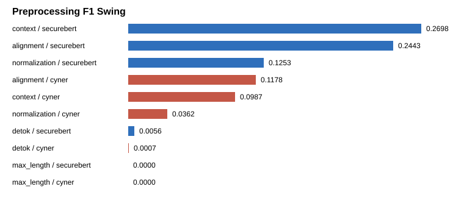

# Preprocessing Sensitivity

| Config | Model | Strict F1 | Gap | 95% CI | Flip? |
|---|---|---:|---:|---|---|
| detok=single_space | securebert | 0.2823 | 0.1785 | [0.1518, 0.2069] | no |
| detok=single_space | cyner | 0.1038 | -0.1785 | [-0.2069, -0.1518] | no |
| detok=punct_aware | securebert | 0.2767 | 0.1736 | [0.1481, 0.2011] | no |
| detok=punct_aware | cyner | 0.1030 | -0.1736 | [-0.2011, -0.1481] | no |
| context=sentence | securebert | 0.2823 | 0.1785 | [0.1518, 0.2069] | no |
| context=sentence | cyner | 0.1038 | -0.1785 | [-0.2069, -0.1518] | no |
| context=document | securebert | 0.0125 | 0.0074 | [0.0024, 0.0136] | no |
| context=document | cyner | 0.0051 | -0.0074 | [-0.0136, -0.0024] | no |
| context=window | securebert | 0.2116 | 0.1260 | [0.1056, 0.1474] | no |
| context=window | cyner | 0.0856 | -0.1260 | [-0.1474, -0.1056] | no |
| max_length=128 | securebert | 0.2823 | 0.1785 | [0.1518, 0.2069] | no |
| max_length=128 | cyner | 0.1038 | -0.1785 | [-0.2069, -0.1518] | no |
| max_length=256 | securebert | 0.2823 | 0.1785 | [0.1518, 0.2069] | no |
| max_length=256 | cyner | 0.1038 | -0.1785 | [-0.2069, -0.1518] | no |
| max_length=full | securebert | 0.2823 | 0.1785 | [0.1518, 0.2069] | no |
| max_length=full | cyner | 0.1038 | -0.1785 | [-0.2069, -0.1518] | no |
| normalization=none | securebert | 0.2823 | 0.1785 | [0.1518, 0.2069] | no |
| normalization=none | cyner | 0.1038 | -0.1785 | [-0.2069, -0.1518] | no |
| normalization=nfkc | securebert | 0.2823 | 0.1785 | [0.1518, 0.2069] | no |
| normalization=nfkc | cyner | 0.1038 | -0.1785 | [-0.2069, -0.1518] | no |
| normalization=refang | securebert | 0.2823 | 0.1785 | [0.1518, 0.2069] | no |
| normalization=refang | cyner | 0.1038 | -0.1785 | [-0.2069, -0.1518] | no |
| normalization=lower | securebert | 0.1570 | 0.0894 | [0.0666, 0.1130] | no |
| normalization=lower | cyner | 0.0676 | -0.0894 | [-0.1130, -0.0666] | no |
| alignment=overlap | securebert | 0.2823 | 0.1785 | [0.1518, 0.2069] | no |
| alignment=overlap | cyner | 0.1038 | -0.1785 | [-0.2069, -0.1518] | no |
| alignment=majority | securebert | 0.5266 | 0.3051 | [0.2717, 0.3382] | no |
| alignment=majority | cyner | 0.2216 | -0.3051 | [-0.3382, -0.2717] | no |
| alignment=contained | securebert | 0.4617 | 0.3169 | [0.2838, 0.3509] | no |
| alignment=contained | cyner | 0.1448 | -0.3169 | [-0.3509, -0.2838] | no |
