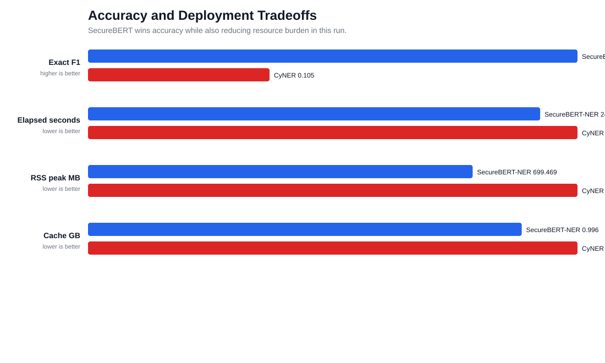

# ThreatExtract Fork 1: DNRTI NER Benchmark

A CVPR-style project page for model selection under label-space mismatch,
data-leakage risk, and offline deployment constraints.

## Abstract

We compare SecureBERT-NER and CyNER on DNRTI, a cybersecurity NER dataset
whose taxonomy differs from both model taxonomies. The evaluation maps
model outputs to DNRTI labels using the assignment PDF, then reports exact
span F1, relaxed overlap F1, per-label behavior, subset-size stability, and
offline operational metrics. SecureBERT-NER is the current evidence leader;
deployment selection is intentionally left to the reviewer/product owner.


## Key Result


| Model | Exact F1 | Relaxed F1 | Exact recall | Elapsed s | RSS peak MB |
|---|---:|---:|---:|---:|---:|
| SecureBERT-NER | 0.2823 | 0.5086 | 0.3820 | 24.140 | 812.765625 |
| CyNER | 0.1047 | 0.2604 | 0.0928 | 27.400 | 948.53125 |

## Figure Gallery




## Paper-Style Sections

- [Benchmark summary](benchmark_summary.md)
- [Dataset audit](dataset_audit.md)
- [Label mapping](label_mapping.md)
- [Literature and leakage](literature_and_leakage.md)
- [Dataset-size scaling](dataset_size_scaling.md)
- [Operational metrics](operational_metrics.md)
- [Evidence leader summary](final_selection.md)

## Reproduction

```bash
make reproduce
```

## Dataset Snapshot

DNRTI test split: `664` sentences, `17716` tokens,
`2348` collapsed entity spans.
